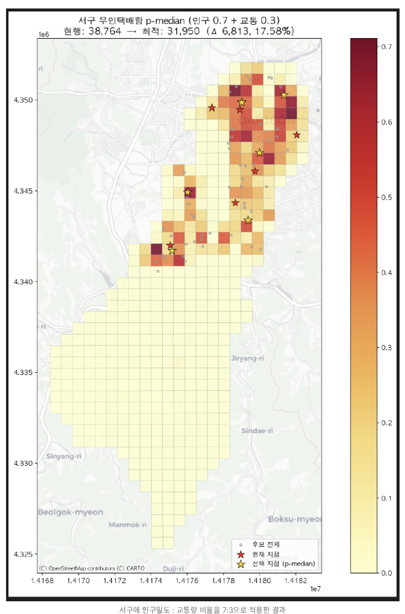
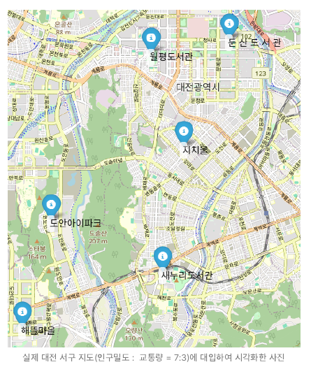
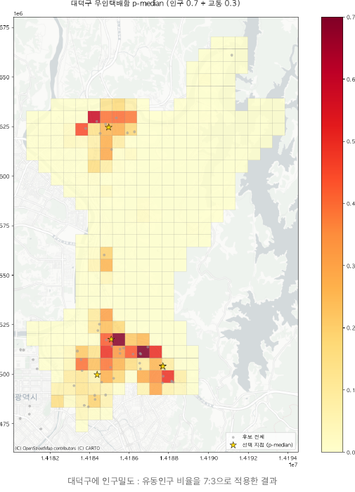
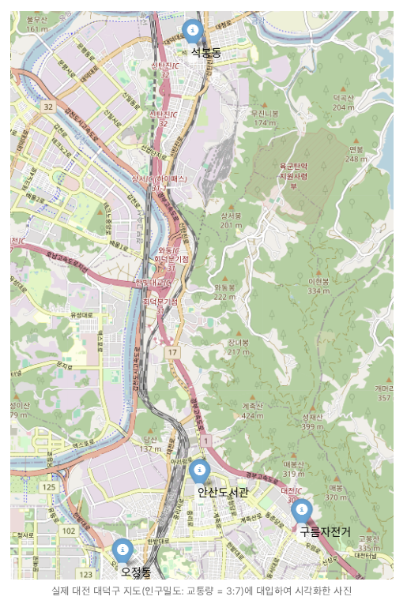

# Opt-Box

> **공공데이터와 공간분석, 수리최적화를 활용한 대전광역시 무인택배함 최적 입지 선정 및 재배치 프로젝트**

본 프로젝트는 **2025년 물류데이터 활용 및 분석 아이디어 공모전**을 위해 수행한 분석 프로젝트입니다. 대전광역시 **서구와 대덕구**를 대상으로 인구밀도와 대중교통 이용량을 결합해 잠재 수요를 산정하고, **Weighted Coverage Model**과 **p-Median Model**을 적용하여 무인택배함의 최소 설치대수와 최적 입지를 분석했습니다.

---

## 1. 프로젝트 배경

기존 무인택배함의 입지는 과거 민원이나 부지 여건 중심으로 축적되어, 변화한 인구분포와 교통환경을 충분히 반영하지 못할 가능성이 있습니다.

이에 본 프로젝트는 다음 질문에 데이터 기반으로 답하고자 했습니다.

- 일정 수준 이상의 주민에게 서비스를 제공하려면 **최소 몇 개의 무인택배함이 필요한가?**
- 동일한 개수의 시설을 유지한다면 **어디에 배치해야 주민의 접근거리를 최소화할 수 있는가?**
- 인구 중심 정책과 교통 중심 정책에 따라 **최적 입지는 어떻게 달라지는가?**

---

## 2. 활용 데이터

| 데이터 | 활용 목적 |
|---|---|
| 국토정보플랫폼 격자 단위 인구밀도 | 지역별 잠재 수요 산정 |
| 대전광역시 버스정류장별 월평균 승하차 인원 | 생활·유동인구 반영 |
| 대전교통공사 역별 월별 승하차 인원 | 지하철 기반 유동인구 반영 |
| 무인택배함 현황 데이터 | 기존 시설 위치 분석 |
| 설치 후보지 좌표 데이터 | 신규 설치 및 재배치 후보 구성 |

인구 데이터는 **250m 격자 단위**로 활용하였으며, 버스·지하철 승하차 데이터를 공간조인하여 격자별 교통 수요를 결합했습니다.

---

## 3. 분석 프로세스

### 3.1 공간데이터 전처리

- 좌표계 통일: `EPSG:5179`
- 비유효 Geometry 제거
- 인구격자 중심점(Centroid)을 수요 대표지점으로 설정
- 버스·지하철 정류장과 인구격자 Spatial Join
- 격자별 평균 교통 이용량 계산
- Min-Max Scaling을 통한 변수 정규화

기본 수요 가중치는 다음과 같이 구성했습니다.

```text
Demand Weight = 0.7 × Population + 0.3 × Transit
```

정책 방향에 따른 민감도 분석을 위해 다음 세 가지 시나리오를 함께 고려했습니다.

```text
Population : Transit
7 : 3
5 : 5
3 : 7
```

---

## 4. 1단계: Weighted Coverage Model

1단계에서는 **목표 서비스 커버율을 만족하는 최소 시설 수**를 계산했습니다.

```text
Coverage Radius = 1.5 km
Target Coverage = 90%
```

수요지점이 선택된 무인택배함으로부터 1.5km 이내에 있으면 서비스 가능한 것으로 정의하고, 전체 가중 수요의 90% 이상을 커버하면서 시설 개수를 최소화했습니다.

### 주요 결과

| 지역 | 최소 필요 시설 수 | 비고 |
|---|---:|---|
| 대덕구 | **4개** | 신규 설치 시나리오 |
| 서구 | **6개** | 현행 설치 수와 일치 |

서구에서는 최소 설치대수 6개, 가중 커버리지 약 **94.8%**가 도출되어 분석 조건의 현실성을 검토하는 기준으로 활용했습니다.

---

## 5. 2단계: p-Median Optimization

2단계에서는 시설 개수를 고정한 상태에서 **전체 수요지점의 가중 이동거리 합을 최소화**하도록 후보지를 선택했습니다.

개념적 목적함수는 다음과 같습니다.

```text
Minimize Σ Demand_i × Distance_ij × Assignment_ij
```

주요 제약조건은 다음과 같습니다.

1. 설치 시설 수는 `p`개로 고정
2. 각 수요지점은 하나의 시설에만 할당
3. 선택된 후보지에만 수요 할당 가능
4. 시설 선택 및 수요 할당 변수는 Binary Variable

---

## 6. 분석 결과 시각화

### 서구 - 인구 0.7 : 교통 0.3



동일한 6개 시설을 유지하면서 재배치한 결과, **현행 대비 약 15.8% 수준의 목적함수 개선**이 나타났습니다.

### 서구 - 선택 지점 지도



---

### 대덕구 - 인구 0.7 : 교통 0.3



1단계에서 산정한 최소 설치대수 **4개**를 기준으로 후보지 중 최적 입지를 선정했습니다.

### 대덕구 - 선택 지점 지도



---

## 7. 주요 결과 요약

- 대덕구의 목표 커버율 90%를 달성하기 위한 최소 무인택배함 수를 **4개**로 산정
- 서구에서는 동일한 수의 시설을 재배치할 경우 **약 15~18% 수준의 접근성 개선 가능성** 확인
- 인구와 교통의 가중치를 `7:3`, `5:5`, `3:7`로 변경하여 정책 우선순위에 따른 입지 변화 분석 가능
- 단순 증설이 아니라 **기존 시설 수를 유지한 재배치 전략**도 정량적으로 평가 가능
- 공공데이터 갱신 시 동일 모델을 재실행할 수 있어 정책 의사결정 지원 도구로 확장 가능

---

## 8. 사용 기술

### Language
- Python

### Data Analysis
- Pandas
- NumPy

### Spatial Analysis
- GeoPandas
- Shapely

### Optimization
- Gurobi
- Mixed Integer Programming (MIP)
- Weighted Coverage Model
- p-Median Model

### Visualization
- Matplotlib
- Contextily

### Coordinate Reference System
- EPSG:4326
- EPSG:5179
- EPSG:3857

---

## 9. Repository Structure

```text
Opt-Box/
├── README.md
├── images/
│   ├── seogu_pmedian_70_30.png
│   ├── seogu_selected_sites.png
│   ├── daedeok_pmedian_70_30.png
│   └── daedeok_selected_sites.png
└── docs/
    ├── proposal.pdf
    └── analysis_report.pdf
```

---

## 10. 상세 문서

- [공모전 제안서](docs/proposal.pdf)
- [데이터 분석 결과 보고서](docs/analysis_report.pdf)

---

## 11. 프로젝트 의의

본 프로젝트는 단순 지도 시각화에 그치지 않고,

**공간데이터 전처리 → 잠재 수요 산정 → 최소 시설 수 결정 → p-Median 입지 최적화 → 현행안과 최적안 비교**

의 전 과정을 하나의 분석 흐름으로 구성했다는 점에 의의가 있습니다.

특히 행정기관이 정책 목표에 따라 인구와 교통의 중요도를 조정할 수 있도록 설계하여, 형평성 중심·균형형·회전율 중심 등 다양한 시설 배치 시나리오에 적용할 수 있습니다.

---

## GitHub Topics

`python` `data-analysis` `geospatial-analysis` `optimization` `operations-research` `p-median` `facility-location` `gurobi` `geopandas` `public-data` `logistics`
